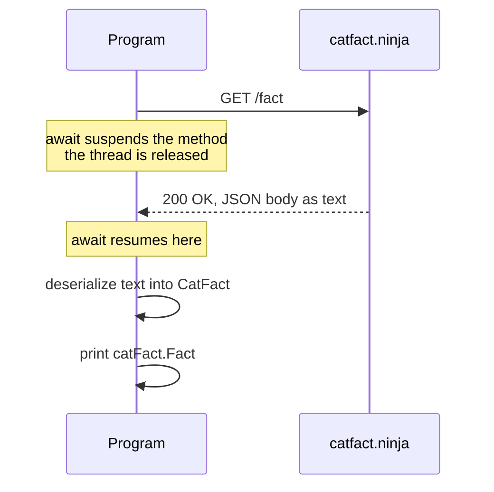
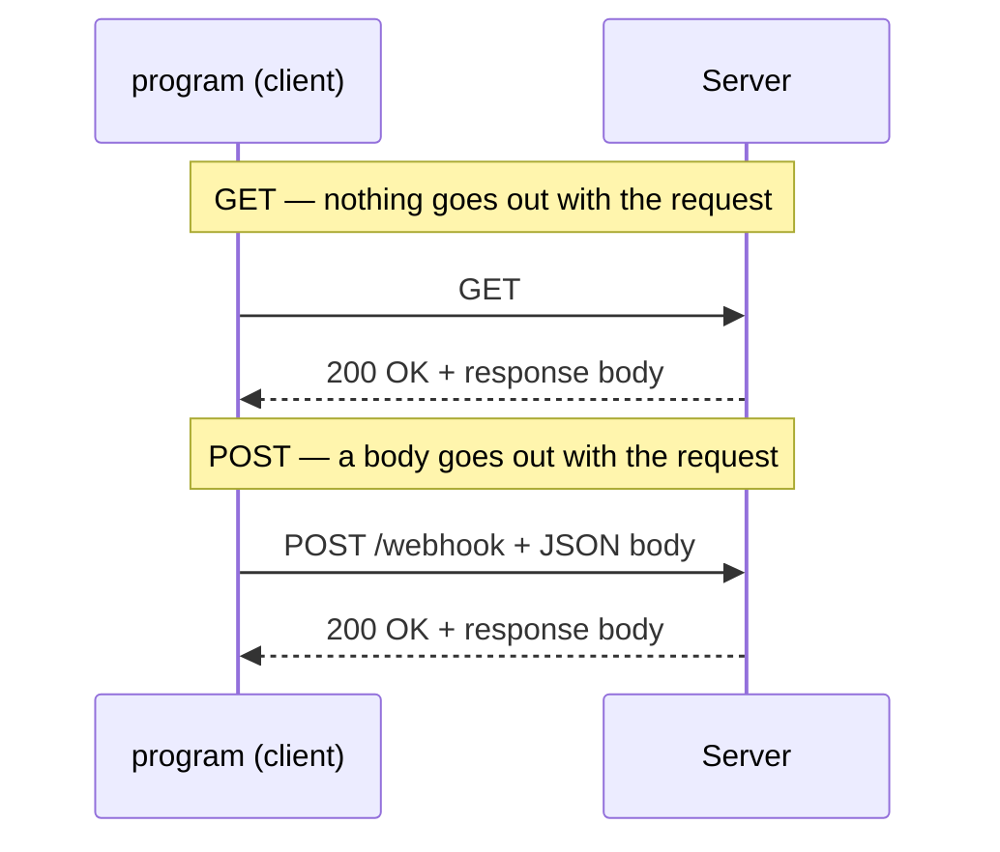

# Network programming 

In this course i was tasked to work with network programming using Webstorm and c#

# 01 - Get

## 1.  What does  `GET`  mean?

Get is basically saying to the api/server "Give me something" its a request that asks the serever for data without sending any.



## 2.  Where is the cat fact generated?

The cat fact is not something my progtam generates, it comes from catfact.ninjas server which picks one and sends it back to us in the response the code we wrote only asks and recives and i display it which is why each run gives different fact. [API](https://catfact.ninja/fact)

## 3.  What does  `await`  do here?

Await suspends the method at that line and releases the thread. so the thread is free for other work while we wait for request, when the response arrives the method continues and the await evaluates to the value itself, everything after the awwait waits for that

##  4.  What is JSON?

JSON stands for JavaScript Object Notation, its a text format for structured data.
objects are in `{}` with `"key": value` in pairs and arrays are in `[]`
its all plain text and which is why it can travel over HTTP. It e4xist because the client and the server arent always writtten in the same language and share no types. so with JSON they agree on a netrual format instead, and thats why converting a c# object into JSON is serialization
vise versa when you convert JSON back to c# (deserialization)

Basically, in short
JSON is a universal format every language can read and write.
It's built from a few pieces:
{ } -        an object
"key": value - a pair inside an object
[ ] - an array (a list)

## 5.  What is the difference between the raw JSON response and a  `CatFact`  object?

The difference between these two are about sepreation and how they printed on the console. when we did it with raw JSON respone it looked something like this

    {"fact":"Cats sleep 70% of their lives.","length":30}
    
c# knows nothing about what is inside here, so to pull out just the fact I'd have to searth through the text myself `"fact"`

A `CatFact` is an object with two typed properties

    public class CatFact
    {
        public string Fact { get; set; } = "";
        public int Length { get; set; }
    }
Fact is a string and Lenght is a int, the complier knows both exist so i get autocomplete, and a build error if i misspell one this also breaks the moment the server changes anything.

Deserialization is what turns the first part into the second `GetFromJsonAsync<CatFact>` reads the JSON keys, and matches them to my property names and writes the values in the set, then I write console.WriteLine so it can read one back out through get which is why i can just print 

```
Cats sleep 70% of their lives.
```

# 
# 02 - Post

## 1. What is the difference between  `GET`  and  `POST`?

The difference  is on the way out, get, gets only usses url and doesnt request body, as post is the same but it sends to an url with a body of data such as what we did in this section, both **receive back** a status code and a response body


## 2. Where can you see the body of the request?

We can see the see the body of the request in the webhook and what was being sent to the server or what is sent.



## 3. What format are we using to send the data?

We are usin JSON format to send over first we serilaize it into json then send it over

## 4. What does serialization mean?

Serialization is turning an object in memory into a format that can be sent or stored, on this progtam my `PostData` object only exist inside the program the  `PostAsJsonAsync` serialized it into the json string that showed up in webhook site

## 5. Why do the client and server need to agree on the names and types of fields?

The client and server never share code, they only share the JSON text between them. the names are the only link, if i send for example `username` but the server wants just `name` nothing will crash the request will pass and reutn 200, but it arrives empty or as a default thats why they need to share the same names and types of fields because it wont crash it will just fail silently
